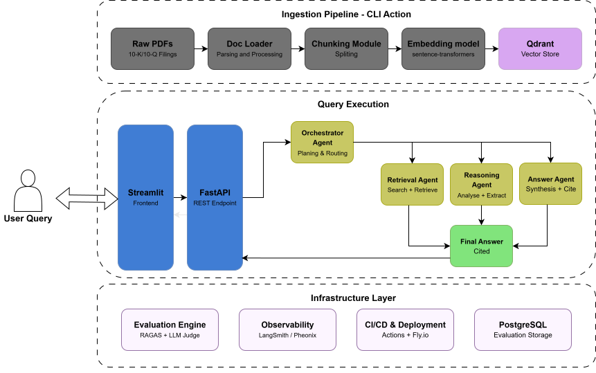

# DocuMind - Architecture

DocuMind is a multi-agent document intelligence system that performs multi-hop reasoning to answer complex financial user queries. This document describes the overall system architecture of DocuMind.

## Table of Contents

- [Data Ingestion Pipeline](#1-data-ingestion-pipeline)
   - [Document Loader](#11-document-loader)
   - [Chunking Module](#12-chunking)
   - [Embedding](#13-embedding)
   - [Vector Store](#14-vector-store)
- [Retrieval Layer](#2-retrieval-layer)
   - [Query Expansion & Understanding](#21-query-exapansion--understanding)
   - [Hybrid Search](#22-hybrid-search)
   - [Re-Ranking](#23-re-ranking)
- [Agent Orchestration Layer](#3-agent-orchestration-layer)
- [Infrastructure Layer](#4-infrastructure-layer)
   - [Evaluation Engine](#41-evaluation-engine)
   - [Observability](#42-observability)
   - [Deployment](#43-deployment)
   - [PostgreSQL](#44-postgresql)
- [Frontend](#frontend)

## 1. Data Ingestion Pipeline

The Data Ingestion Pipeline will be designed to load, process, and ingest the financial documents PDFs into a vector database. This process will include Chunking and Embedding of the documents to produce indexes that can be retrieved later in the Retrieval Layer. It will be an offline ingestion of the documents, which means it will be triggered by a simple CLI action.

### 1.1. Document Loader

This is the first step in the pipeline. Here, the PDF will be handled. It includes cleaning the PDFs, extracting tables, page headers, footers, etc. Since the financial PDFs are large files with a complex file structure, this step becomes very important in the pipeline.

### 1.2. Chunking Module

After the document is loaded in the pipeline, the Chunking module will create chunks of the document. I will experiment with different chunking strategies (fixed-size, sentence-aware, and semantic chunking). Trade-offs between different strategies will be observed and documented. The final strategy will be decided and implemented after the POC.

### 1.3. Embedding Model

HuggingFace's Sentence Transformer ([SBERT](https://huggingface.co/sentence-transformers)) will be used to embed the chunks from the chunking module. These embeddings will be vectors representing the semantic meaning of a very high dimension size, which can be used to retrieve later using semantic similarity search. 

### 1.4. Vector Store

[Qdrant](https://qdrant.tech/) will be used to store and index these vector embeddings. Each vector will have its own metadata like `document_name`,`page_number`,`section`,`chunk_id`,. Qdrant is chosen over FAISS because it is an open-source, production-ready vector database that provides some internal features like hybrid search.

## 2. Retrieval Layer

When the user query is received, a REST API is triggered. Then, a query understanding LLM will understand the query, rewrite it and then a hybrid search will be used to retrieve the information required to answer this query.

### 2.1. Query Expansion & Understanding

A user query can be a simple 1-line text, for e.g., ``"What are the YoY earnings of company X in the last Y years?"``. In a multi-agent setup, it is necessary to rewrite this query into smaller sub-queries, which can then be used to retrieve individual information. An LLM is used in this step.

### 2.2. Hybrid Search

Provided by Qdrant out of the box, this strategy combines BM25, keyword-based search and vector search to retrieve information. This search becomes especially useful when exact keywords in the search query matter. In this project, keywords like `quarter`, `earnings`, or even specific dates, names and figures will be handled by hybrid search.

### 2.3. Re-Ranking

Using a cross-encoder re-ranker, the top-20 results retrieved from hybrid search will then be re-ranked to return top-5 results. This process significantly improves the output quality and leads to fewer errors and LLM Hallucinations.

## 3. Agent Orchestration Layer

DocuMind is a multi-agent system, where every task is done by a task-specific AI agent. This project is intended to use 4 AI agents, each with a dedicated task from task planning to the final response:

- <b>Orchestrator Agent:</b> This agent will plan the task and route the request to other agents.
- <b>Retrieval Agent:</b> As shown in [Retrieval Layer](#22-hybrid-search), this agent will search for the specific information from the vector database and retrieve it. It will be a function call and not an LLM action
- <b>Reasoning Agent:</b> This agent will analyse the retrieved intermediate information and extract specific facts
- <b>Answer Agent:</b> This agent will answer the query based upon all the retrieved intermediate answers with a proper citation for each of the facts.

## 4. Infrastructure Layer

This layer deals with Evaluation, Observability and Deployments. This layer will distinguish a personal project with a fully implemented production-grade AI system.

### 4.1. Evaluation Engine
In RAG-based AI Systems, measuring the output quality is very important. Hence, this engine will use RAGAS and an LLM-as-a-judge to score the outputs. Moreover, a golden-test set of 30-50 manually created question-answer pairs will be created to test the system failures.

### 4.2. Observability
Since all of the multi-agent system is wrapped under REST endpoints, tracing the request flow in a well-structured JSON log will be implemented with either LangSmith or Phoenix. Each log will have consistent fields like ``trace_id``, ``model``, ``status``, etc., to ensure better traceability and observability. Moreover, endpoints like  `/metrics` and `/health` will be exposed. 

### 4.3. Deployment

The system will be deployed through a Docker container to a live URL using Railway or Fly.io. The CI/CD pipeline will be created on GitHub actions, which will run a test suite and an evaluation suite on the golden-test set on every push to the main branch.

### 4.4. PostgreSQL

PostgreSQL will be used as the evaluation storage to store the performance evaluation of the system. It will store the information as follows:
- <b>scores</b>: `score_id`, `user_prompt`, `final_llm_output`, `faithfulness`, `context_precision`, `context_recall`, `answer_relevancy`, `llm_judge_score`, `llm_judge_feedback`, `timestamp`
- <b>chunks</b>: `chunk_id`, `score_id`, `retrieved_chunk`

`scores` and `chunks` table will have a 1:N relationship where chunks will store all the retrieved chunks for that user prompt. These data will be written to the database in async manner to not increase the response time

## 5. Frontend

To make this application accessible and presentable to users, a frontend using Streamlit will be developed. 